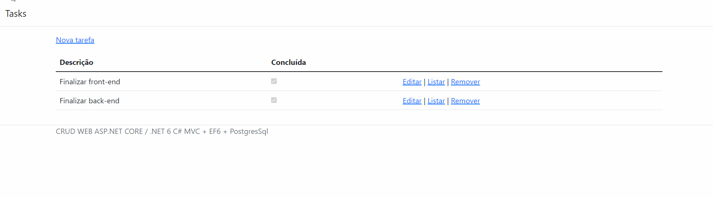

# Tasks To Do

<p align="center">
    <a href="#aplicação-para-gerenciamento-de-um-cinema">Aplicação</a>&nbsp;&nbsp;|&nbsp;&nbsp;
    <a href="#-tecnologias-e-frameworks">Tecnologias e Frameworks</a>&nbsp;&nbsp;|&nbsp;&nbsp;
    <a href="#pré-requisitos">Pré-requisitos</a>&nbsp;&nbsp;|&nbsp;&nbsp;
    <a href="#executando-a-aplicação">Executando a aplicação</a>&nbsp;&nbsp;|&nbsp;&nbsp;
    <a href="#features">Features</a>&nbsp;&nbsp;|&nbsp;&nbsp;
    <a href="#-autor">Autor</a>
</p>



### Aplicação para gerenciamento de Tasks
Projeto de gerenciamento de tarefas WEB usando ASP.NET CORE / .NET 6 C# MVC + EF6 + PostgresSql

## 🛠 Tecnologias e Frameworks
- [.NET 6](https://visualstudio.microsoft.com/pt-br/vs/community/)
- [PostgreSql](https://www.postgresql.org/)
- [Entity Framework 6](https://entityframework.net/)

## Pré-requisitos
- Visual Studio versão 17.0 ou superior de 2022 para compilação e execuçã - [VisualStudio](https://visualstudio.microsoft.com/pt-br/vs/community/)

## 🎲 Executando a aplicação
```bash
# Clone este repositório ou faça o download .zip e extraia os arquivos
$ git clone <https://github.com/GuilhermeAFerrari/Task-to-do.git>

# Acesse a pasta do projeto e abra o arquvio Tasks-web.sln com o Visual Studio

# Altere as informações de conexão com o banco de dados PostgreSql no arquivo Program.cs

# No console do gerenciador de pacotes execute o comando abaixo para realizar a criação do banco de dados, tabelas e atributos contidos na classe Contexto.cs
## Update-database -Context Contexto

# Execute a aplicação (CRTL+F5)
```

## Features
- Listar Tasks
- Criar Tasks
- Editar Tasks
- Visualizar Tasks
- Remover Tasks

## 😎 Autor
- Guilherme Ferrari
- E-mail: guile.ferrari@hotmail.com
- [](https://www.linkedin.com/in/guilherme-antonio-ferrari/)
